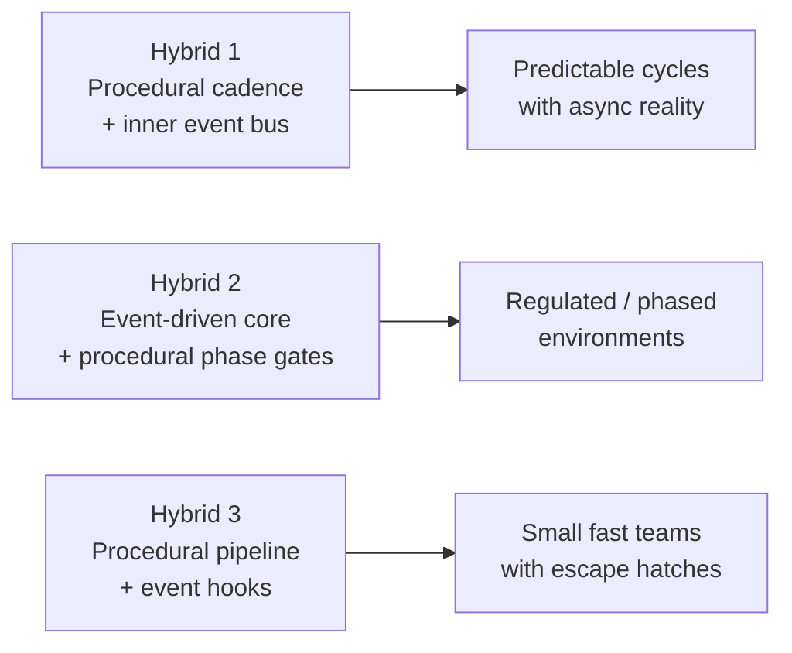

# Product Life Cycle Pseudo Code — Hybrid Designs

Three different ways to combine **procedural** and **event-driven** styles for the feedback-led product life cycle. All three reuse the Core Activities and Core Artifacts vocabulary from [FeedbackLedAgentBusiness.md](FeedbackLedAgentBusiness.md):

- **Artifacts**: UserFeedback&Analysis, UserJourneys, Capabilities&Rules, SystemArchitecture, ProductRoadmap, DevelopmentLifecycle, TechnicalTasks, Epics/PRDs, TDDs, UserStories, SubTasks, SoftwareAssets
- **Activities**: gather/analyze feedback, iterate on each artifact, create downstream artifacts, implement, test & evaluate

Each section below describes the same lifecycle but with a different procedural/event-driven balance.

---

## Hybrid 1 — Procedural Cadence with Inner Event Bus

An outer **procedural** loop (e.g., a sprint or planning cycle) drives ordered artifact iteration. Inside each cycle, work fans out via an **event bus** so async feedback, blockers, and parallel implementation can flow without waiting for the next tick.

```text
bus = EventBus()

# --- async handlers always running in background ---
on bus.FeedbackArrived(item):
    UserFeedback&Analysis.append(analyze(item))
    if item.severity == HIGH:
        bus.emit(InterruptCycle(reason=item))

on bus.BlockerRaised(blocker):
    pause(blocker.owner_artifact)
    notify(maintainers)

on bus.ImplementationDone(task, assets):
    SoftwareAssets.merge(assets)
    bus.emit(FeedbackArrived(test_and_evaluate(task, assets)))

# --- procedural outer cadence ---
function run_cycle():
    while product_exists:
        # Phase 1: discover (procedural, ordered)
        UserJourneys       = iterate(UserJourneys, UserFeedback&Analysis)
        Capabilities&Rules = iterate(Capabilities&Rules, UserJourneys)
        SystemArchitecture = iterate(SystemArchitecture, Capabilities&Rules)

        # Phase 2: plan (procedural)
        ProductRoadmap       = iterate(ProductRoadmap, UserJourneys, SystemArchitecture)
        DevelopmentLifecycle = iterate(DevelopmentLifecycle, ProductRoadmap)

        # Phase 3: decompose (fan out via events for parallelism)
        bus.emit(EpicsRequested(ProductRoadmap, UserJourneys))
        bus.emit(TechnicalTasksRequested(DevelopmentLifecycle))
        wait_until([EpicsReady, TechnicalTasksReady], timeout=cycle_budget)

        # Continued decomposition (procedural ordering after fan-out)
        TDDs        = create_tdds(Epics/PRDs, SystemArchitecture)
        UserStories = create_user_stories(Epics/PRDs, TDDs)
        SubTasks    = create_sub_tasks(UserStories)

        # Phase 4: build (events drive parallel execution)
        for task in TechnicalTasks + SubTasks:
            bus.emit(ImplementationRequested(task))

        wait_until(cycle_complete or InterruptCycle, max=cycle_budget)
```

**When to pick:** predictable cadence with room for async reality — most product teams.

---

## Hybrid 2 — Event-Driven Core Gated by Procedural Phases

The system is **event-driven** internally, but progression is gated by named **procedural phases** (Discover, Design, Plan, Build, Verify). A phase only "closes" when its exit criteria (a procedural check) are met; events keep firing inside it until then.

```text
phase  = "Discover"
phases = ["Discover", "Design", "Plan", "Build", "Verify"]

function advance_when_ready():
    if exit_criteria_met(phase):
        phase = next(phases, phase)
        emit(PhaseEntered(phase))

# --- Discover ---
on FeedbackArrived(f) when phase == "Discover":
    UserFeedback&Analysis.append(analyze(f))
    UserJourneys = iterate(UserJourneys, UserFeedback&Analysis)
    advance_when_ready()  # e.g., journeys stable for N hours

# --- Design ---
on PhaseEntered("Design"):
    Capabilities&Rules = iterate(Capabilities&Rules, UserJourneys)
    SystemArchitecture = iterate(SystemArchitecture, Capabilities&Rules)
    advance_when_ready()

# --- Plan ---
on PhaseEntered("Plan"):
    ProductRoadmap       = iterate(ProductRoadmap, UserJourneys, SystemArchitecture)
    DevelopmentLifecycle = iterate(DevelopmentLifecycle, ProductRoadmap)
    Epics/PRDs     = create_epics_prds(ProductRoadmap, UserJourneys)
    TDDs           = create_tdds(Epics/PRDs, SystemArchitecture)
    UserStories    = create_user_stories(Epics/PRDs, TDDs)
    SubTasks       = create_sub_tasks(UserStories)
    TechnicalTasks = create_technical_tasks(DevelopmentLifecycle)
    advance_when_ready()

# --- Build (fully event-driven inside) ---
on PhaseEntered("Build"):
    for task in TechnicalTasks + SubTasks:
        emit(Implement(task))

on Implement(task) when phase == "Build":
    SoftwareAssets += implement(task)
    emit(VerifyRequested(task))

# --- Verify ---
on VerifyRequested(task) when phase in ("Build", "Verify"):
    results = test_and_evaluate(task, SoftwareAssets)
    emit(FeedbackArrived(results))     # closes loop back to Discover
    advance_when_ready()               # may flip back to Discover
```

**When to pick:** regulated or structured environments where phase gates matter — compliance, hardware, large enterprise.

---

## Hybrid 3 — Procedural Pipeline with Event Hooks

A linear **procedural pipeline** is the spine. Each stage exposes **hook points** (`on_feedback`, `on_blocker`, `on_release`, `on_test_failure`) that can short-circuit, branch, or roll back the pipeline.

```text
pipeline = [discover, design, plan, decompose, build, verify, release]

hooks = {
    "on_feedback":     [reprioritize, maybe_restart_at("discover")],
    "on_blocker":      [pause_stage, notify_owner],
    "on_test_failure": [rewind_to("build"), bump_priority],
    "on_release":      [emit FeedbackArrived(release_metrics)],
}

function run_pipeline():
    state = initial_state()
    while product_exists:
        for stage in pipeline:
            with hook_context(stage, hooks) as ctx:
                state = stage(state)        # procedural step
                ctx.drain_events()          # service any hooks fired
                if ctx.requested_jump:
                    jump_to(ctx.requested_jump); break

# --- stages (procedural) ---
function discover(s):
    s.UserFeedback&Analysis.update(analyze(gather_feedback(...)))
    s.UserJourneys = iterate(s.UserJourneys, s.UserFeedback&Analysis)
    return s

function design(s):
    s.Capabilities&Rules = iterate(s.Capabilities&Rules, s.UserJourneys)
    s.SystemArchitecture = iterate(s.SystemArchitecture, s.Capabilities&Rules)
    return s

function plan(s):
    s.ProductRoadmap       = iterate(s.ProductRoadmap, s.UserJourneys, s.SystemArchitecture)
    s.DevelopmentLifecycle = iterate(s.DevelopmentLifecycle, s.ProductRoadmap)
    return s

function decompose(s):
    s.Epics/PRDs     = create_epics_prds(s.ProductRoadmap, s.UserJourneys)
    s.TDDs           = create_tdds(s.Epics/PRDs, s.SystemArchitecture)
    s.UserStories    = create_user_stories(s.Epics/PRDs, s.TDDs)
    s.SubTasks       = create_sub_tasks(s.UserStories)
    s.TechnicalTasks = create_technical_tasks(s.DevelopmentLifecycle)
    return s

function build(s):
    for task in s.TechnicalTasks + s.SubTasks:
        s.SoftwareAssets += implement(task)
    return s

function verify(s):
    for task in s.TechnicalTasks + s.SubTasks:
        results = test_and_evaluate(task, s.SoftwareAssets)
        if results.failed:
            fire("on_test_failure", results)
    return s

function release(s):
    metrics = ship(s.SoftwareAssets)
    fire("on_release", metrics)            # feeds back into discover
    return s
```

**When to pick:** small, fast teams that want a clean linear flow but need controlled escape hatches for reality.

---

## Comparison at a glance



| Hybrid | Spine                 | Async layer                     | Strength                                  | Trade-off                                    |
| ------ | --------------------- | ------------------------------- | ----------------------------------------- | -------------------------------------------- |
| 1      | Procedural cycle      | Event bus inside cycle          | Predictable rhythm + parallel work        | Async events bounded by cycle budget         |
| 2      | Event-driven handlers | Procedural phase gates          | Strong gating, auditability               | Phase advancement logic adds complexity      |
| 3      | Procedural pipeline   | Event hooks at stage boundaries | Simple to read, controlled escape hatches | Hooks can mask hidden complexity if overused |
